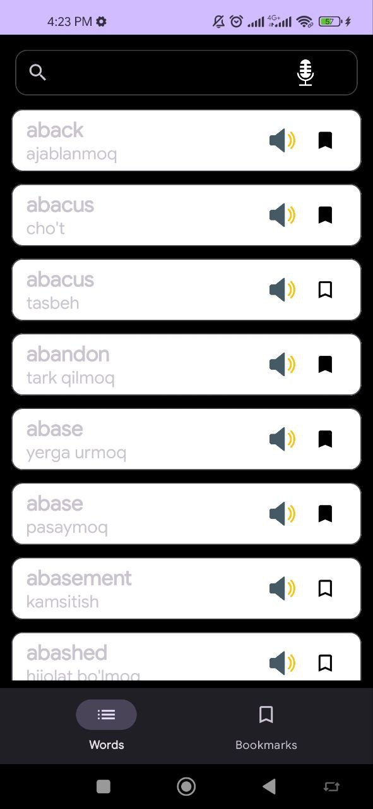
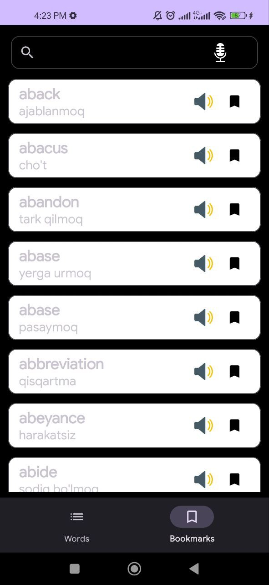
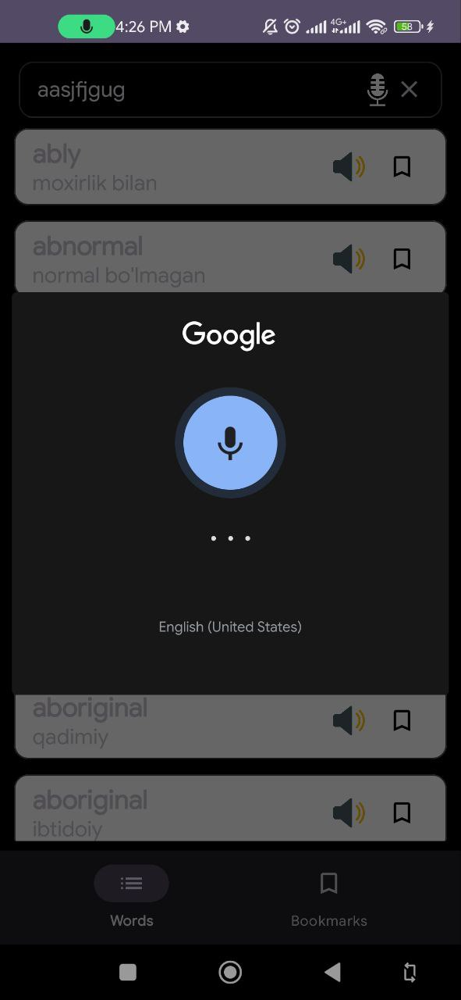
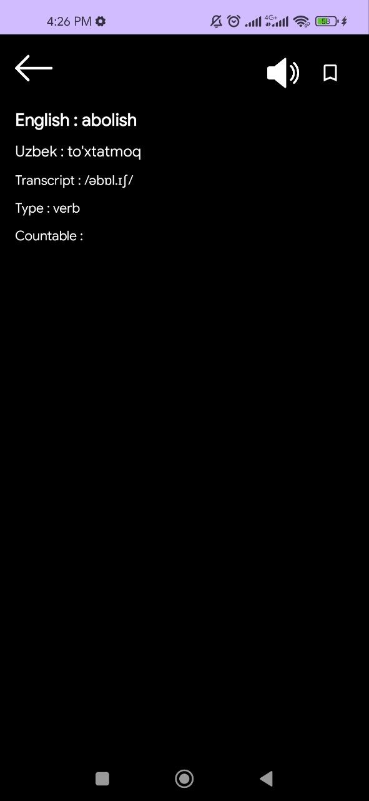

# Dictionary App

A lightweight and user-friendly **Android Dictionary Application** that allows users to quickly search and view word meanings. The app is designed with a clean interface and follows modern Android development best practices.

---

## Features

* Search words instantly
* View word definitions clearly
* Fast and responsive UI
* Simple and intuitive user experience
* Offline-friendly architecture (if local data is used)

---

## Screenshots

<div style="display: flex; gap: 12px; flex-wrap: wrap;">
  
  
  
  
</div>

---

## Tech Stack

* **Language:** Kotlin
* **Platform:** Android
* **Architecture:** MVVM
* **UI:** XML
* **Networking / Data:** API or Local Database (depending on implementation)

---

## Getting Started

1. Clone the repository

   ```bash
   git clone https://github.com/IslombekYoqubov/Dictionary_App.git
   ```
2. Open the project in **Android Studio**
3. Sync Gradle files
4. Run the app on an emulator or physical Android device

---

## Project Structure

```
Dictionary_App/
│
├── app/
│   ├── data/
│   ├── ui/
│   ├── viewmodel/
│   └── MainActivity.kt
│
├── images/
├── README.md
└── build.gradle
```

---

## License

This project is licensed under the MIT License.

---

## Author

**Islombek Yoqubov**
GitHub: [https://github.com/IslombekYoqubov](https://github.com/IslombekYoqubov)
